# YUNBFSDK Unity Plugin

[版本更新记录](./RELEASE.md)

## 环境要求
### 开发工具
Xcode 16.2.或之后的版本

Unity 2021.3.12 及以后版本

### iOS

unity target(Unity-iPhone) : 16.0 *如果16.0出现编译错误，请改为13.1*

unityframework target: 13.1

## Unity集成

导入`YUNBFSDK_Unity_Plugin_xxxx.unitypackage`。

## 接口使用

### 配置

**Tools/配置（快捷键Alt+G）**

**<font color=red>*测试相关请在发布时务必取消勾选*</font>**

初始化之前请先配置参数，具体数据可从运营获得：

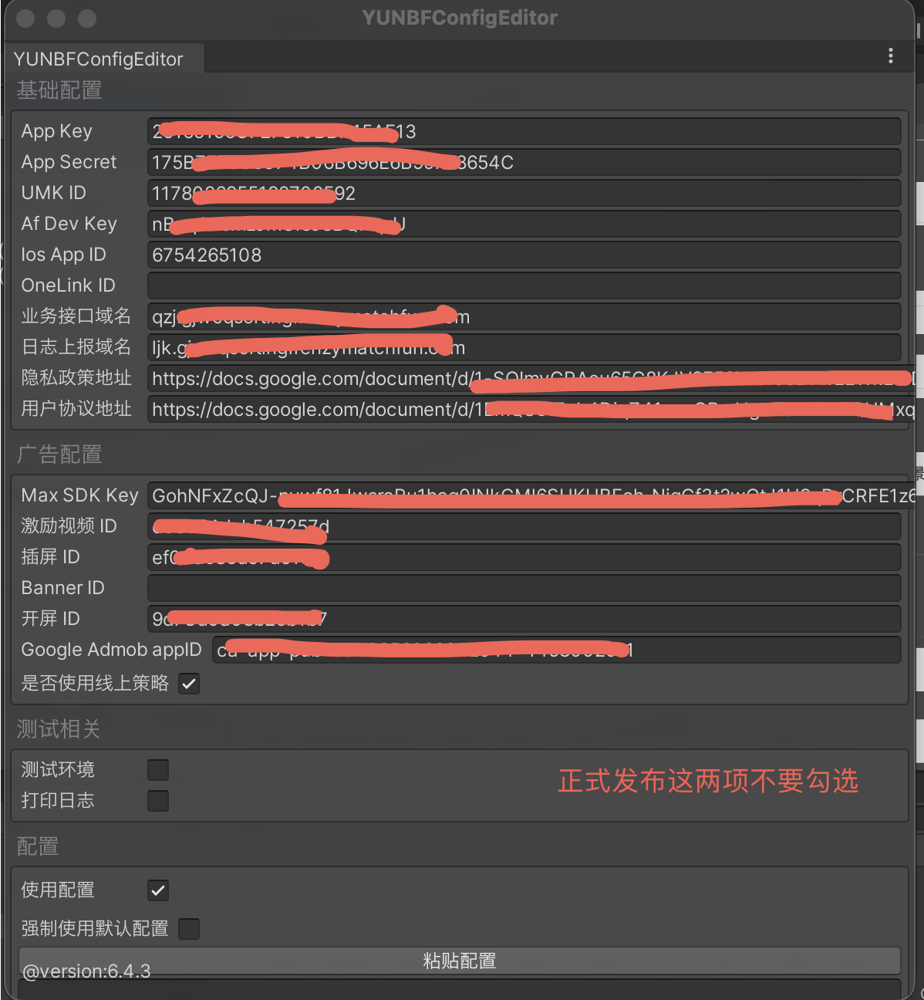

### 初始化

```c#
  YUNBFSDK.Instance.Init((success, info) =>
  {
      Debug.Log(success ? "SDK 初始化成功" : "SDK 初始化失败");
  });
```

其中info是用户信息。

**获取是否激励用户**

```
 public bool IsReward()
 {
	 return YUNBFSDK.Instance.IsReward();
 }
```

### H5入口模块
#### 功能说明
为提升SDK变现能力，接入方必须在产品端添加该模块入口图标，点击图标进入该H5模块。

#### 图标说明
SDK提供入口图标资源，图标默认隐藏状态。
监听SDK接口回调事件：显示｜隐藏入口图标来控制用户是否能进入H5模块。

#### 图标位置
主页或者设置等二级页面。

#### 版本说明
大于等于`YUNBFSDK Unity Plugin` `6.4.4`版本，必须接入该模块。

#### 初始化
请在在SDK初始化成功后调用(即`YUNBFSDK.Instance.Init` 回调内)

```c#
YUNBFSDK.Instance.InitOffer((show) =>
{
    // 显示H5入口图标
    Debug.Log("SDK:InitOffer >>> show:" + show);
},
(hide) =>
{
    // 隐藏H5入口图标
    Debug.Log("SDK:InitOffer >>> hide:" + hide);
});
```

#### 功能入口点击事件调用
```c#
YUNBFSDK.Instance.OnShowPage();
```

### 广告

#### 激励视频

展示

```c#
/// <summary>
/// 展示激励视频广告
/// </summary>
/// <param name="sceneId">广告场景ID，仅用于看数使用，开发者可自定义，但是请保证不同广告场景的命名不同</param>
/// <param name="didReward">激励回调，同时广告也关闭</param>
/// <param name="didFail">展示失败回调</param>
YUNBFSDK.Instance.ShowRewardVideo("TEST", () =>
{
		//给用户奖励，此时广告也关闭
}, () =>
{
		//展示失败
});
```

#### 插屏

展示

```c#
/// <summary>
/// 展示插屏
/// </summary>
/// <param name="sceneId">广告场景ID，仅用于看数使用，开发者可自定义，但是请保证不同广告场景的命名不同</param>
/// <param name="didHide">广告关闭回调</param>
/// <param name="didFail">展示失败回调</param>
YUNBFSDK.Instance.ShowInterstitial("TEST_INS", () =>
{
		//广告展示完成，关闭
  
}, () =>
{
		//展示失败
});
```

#### 开屏广告

展示

```c#
/// <summary>
/// 展示开屏广告，由于广告加载需要时间，建议开发者在应用启动时多等待几秒再调用开屏广告
/// </summary>
/// <param name="sceneId">广告场景ID，仅用于看数使用，开发者可自定义，但是请保证不同广告场景的命名不同</param>
/// <param name="didHide">广告关闭回调</param>
/// <param name="didFail">展示失败回调</param>
YUNBFSDK.Instance.ShowOpenAd("TEST_OPEN", () =>
{
		//广告展示完成，关闭
  
}, () =>
{
		//展示失败
});
```

#### Banner 广告

Banner 广告目前只支持放在底部且只支持单一UnitID，单一场景，广告高度为50pt,

游戏画面底部预留的高度

- 全屏iPhone(没有物理home键)预留(50+34)=83pt
- 非全屏iPhone预留 50pt

展示
```c#
/// <summary>
/// 展示Banner广告
/// </summary>
/// <param name="sceneId">广告场景ID，仅用于看数使用，开发者可自定义，但是请保证不同广告场景的命名不同</param>
/// <param name="didHide">广告关闭回调</param>
/// <param name="didFail">展示失败回调</param>
YUNBFSDK.Instance.ShowBannerAd("TEST_BAN", () =>
{
   Debug.Log("SDK :BANNER DID_Hide");
},
() =>
{
    Debug.Log("SDK :BANNER DID_FAIL");
});
```

隐藏
```c#
// <summary>
/// 隐藏Banner广告
/// </summary>
/// <param name="sceneId">广告场景ID，仅用于看数使用，开发者可自定义，但是请保证不同广告场景的命名不同</param>
YUNBFSDK.Instance.HiddenBannerAd("TEST_BAN");
```

#### 广告是否有缓存
```c#
/// 激励广告有无缓存，true=有缓存
YUNBFSDK.Instance.IsRewardVideoReady();

/// 插屏广告有无缓存，true=有缓存
YUNBFSDK.Instance.IsInterstitialReady();

/// 开屏广告有无缓存，true=有缓存
YUNBFSDK.Instance.IsOpenAdReady();
```

### 广告价格监听
```c#
Events.onAdRevenue += (adInfo) =>
{
// do something
};
```

### 提现相关
```c#
/// <summary>
/// 申请小额提现
/// </summary>
/// <param name="assetsType">资产类型，0:金币 8:美金</param>
/// <param name="paymentType">支付方式</param>
/// <param name="account">提现账户：即用户邮箱或电话号码</param>
/// <param name="name">提现用户昵称,PagBank,Pix类型必填,其中pix 的value 可以用gerenshibiehao</param>
/// <param name="amount">提现数额</param>
/// <param name="act"></param>
/// <param name="disanfangzhanghuleixing">PIX类型必填 C，传值 E、P、C、B E:邮箱 P:手机号 C:(个人税号(CPF)/企业税号(CNPJ) B:(虚拟支付地址(EVP))</param>
/// <param name="gerenshibiehao">PagBank,PIX类型必填 , 收款方个人识别号码，在不同国家下可选类型不同 格式： 999.999.999-99 或 99999999999</param>
YUNBFSDK.Instance.RequestMicroWW(0,"Paypal","testsdfsdfs@gmail.com","",0.01,(bool suc, WithdrawRequestResponse data) => {
    Debug.Log("SDK :tixian" + suc + data?.data?.id);
});

/// <summary>
/// 获取提现记录
/// </summary>
/// <param name="assetsType">货币类型,0:金币提现,8:现金提现</param>
/// <param name="withdrawType">0:普通提现，2: 固定小额提款, 3: 邀请好友提现 6:T3 小额提现</param>
/// <param name="act"></param>
 YUNBFSDK.Instance.GetWWRecord((bool suc, WithdrawRecordData data) => {
        Debug.Log("SDK :tixianjilu" + suc + data?.total);
});
```

### 统计

#### 打点到BI

不带参数

```c#
YUNBFSDK.Instance.Track("eventName");
```

附带拓展参数

```c#
YUNBFSDK.Instance.Track("eventName","key1","value1","key2",2222);
```

TrackImmediately 是即时上报打点，*谨慎使用，除非此事件非常重要，否则尽量避免使用*


#### 打点到AppsFlyer

如果有特殊需要，可使用下列方法打点到AppsFlyer

```c#
Dictionary<string, string> eventValues = new Dictionary<string, string>();
eventValues.Add("key1", "value1");
eventValues.Add("key2", "value2");
Analytics.TrackAF("eventName", eventValues);
```

### 网络接口

⚠️ ***注意：所有接口请在初始化完成后调用。***

#### 获取配置

获取Ark配置

```c#
/// <summary>
/// 请求方舟策略
/// </summary>
/// <param name="bizCodes">请求的业务编码，多个之间使用半角逗号分隔</param>
/// <param name="completeAction"></param>
YUNBFSDK.Instance.FetchArkConfig("TestID",((success, configs) =>
{
    if (success)
    {
        foreach (var abData in configs)
        {
            // abData.vid 当前配置的唯一标识
            foreach (var kv in abData.fields)
            {

                if (kv.fkey.Equals("TestID"))
                {
                    //   kv.fvalue  是配置信息
                }
            }
        }
    }


}));
```

#### 获取用户分层
```c#
YUNBFSDK.Instance.RequestTierInfo((success, tierInfo) => {
    Debug.Log("用户分层结果:RequestTierInfo:" + tierInfo.ToJson());
});
```

## 数据结构

### UserInfo

```c#
 public class YUNBFUserInfo
 {
     /// <summary>
     /// 是否激励用户
     /// </summary>
     public bool Reward { get; set; }
     /// <summary>
     /// 用户ID
     /// </summary>
     public string Uk { get; set; }
     /// <summary>
     /// 活跃天数
     /// </summary>
     public int ActiveDays { get; set; }
     /// <summary>
     /// 注册天数
     /// </summary>
     public int RegisterDays { get; set; }
     /// <summary>
     /// 服务器时间戳
     /// </summary>
     public double ServerTimeStamp { get; set; }

     /// <summary>
     /// 服务器时间
     /// </summary>
     public string Now { get; set; }

     /// <summary>
     /// 国家
     /// </summary>
     public string Country { get; set; }
     /// <summary>
     /// 注册时间
     /// </summary>
     public double CreateTimeStamp { get; set; }

     /// <summary>
     /// 邀请码
     /// </summary>
     public string InviteCode { get; set; }

     /// <summary>
     /// 渠道信息
     /// </summary>
     public string Channel { get; set; }
 }
```

### WithdrawRecordData
```c#
/// <summary>
/// 提现记录数据
/// </summary>
[Serializable]
public class WithdrawRecordData
{
    public float total;

    public List<WithdrawRecordItemData> list;

    public Balances[] zhanghuyue;
}
```

### WithdrawRecordItemData
```c#
/// <summary>
/// 提现记录数据项
/// </summary>
[Serializable]
public class WithdrawRecordItemData
{
    /// <summary>
    /// 记录ID
    /// </summary>
    public string id;

    /// <summary>
    /// 提现类型, (默认)0:金币提现 , 8: 现金提现
    /// </summary>
    public int zichanleixing;

    /// <summary>
    /// 提现方式,Paypal,Zhifubao,ovo,paytm,phonebill-Telkomsel,phonebill-Tairtel,giftcard-amazon中任一种
    /// </summary>
    public string zhifufangshi;

    /// <summary>
    /// 提现金额
    /// </summary>
    public float total;

    /// <summary>
    /// 0:用户提交申请 , 1:已审核通过, 2: 驳回, 3: 已打款
    /// </summary>
    public int status;

    /// <summary>
    /// 提现时间
    /// </summary>
    public string tixianshijian;
}
```

### ArkData
```c#
/// <summary>
/// 方舟配置
/// </summary>
[System.Serializable]
public class ArkData
{
    /// <summary>
    /// 版本号
    /// </summary>
    public string vid;

    /// <summary>
    /// 业务编码
    /// </summary>
    public string biz;

  /// <summary>
  /// 变量列表
  /// </summary>
  public List<ArkKeyValue> fields;
}
```

### ArkKeyValue
```c#
public class ArkKeyValue
{
    /// <summary>
    /// key
    /// </summary>
    public string fkey;

    /// <summary>
    /// value
    /// </summary>
    public string fvalue;
}
```

# Xcode项目配置：

1.配置podfile文件：（这里为必须。另外如需添加其他广告源见[广告源配置]()）：**以下已经固定常见广告源版本，如果不需要的广告源可以去掉对应广告源的可选部分。必须部分不能去掉**。

```
source 'https://cdn.cocoapods.org/'

platform :ios, '13.0'

target 'UnityFramework' do
  pod 'FirebaseAnalytics', :modular_headers => true      #必须
  pod 'FirebaseCrashlytics', :modular_headers => true    #必须
  pod 'FirebaseRemoteConfig', :modular_headers => true   #必须
  pod 'AppsFlyerFramework','6.15.3'                      #必须
  pod 'AppLovinSDK','13.3.1'                           #必须
  pod 'AppLovinMediationBidMachineAdapter','3.3.0.0.2'  #可选，BidMachine广告源
  pod 'AppLovinMediationBigoAdsAdapter','4.8.1.0'       #可选，Bigo广告源
  pod 'AppLovinMediationByteDanceAdapter','7.4.1.0.0'    #可选，pangle广告源
  pod 'AppLovinMediationFacebookAdapter','6.20.1.0'      #可选，Facebook广告源
  pod 'AppLovinMediationFyberAdapter' ,'8.3.8.0'       #可选，fyber/dt exchange广告源
  pod 'AppLovinMediationGoogleAdapter','12.8.0.0'          #可选，admob广告源
  pod 'AppLovinMediationGoogleAdManagerAdapter' ,'12.8.0.0'    #可选，google ad manager广告源
  pod 'AppLovinMediationIronSourceAdapter' ,'8.10.0.0.1'     #可选，ironsource广告源
  pod 'AppLovinMediationMintegralAdapter','7.7.8.0.0'        #可选，Mintegral广告源
  pod 'AppLovinMediationVungleAdapter','7.5.2.0'             #可选，vungle广告源
  pod 'AppLovinMediationUnityAdsAdapter','4.16.5.0'        #可选，unity广告源
  pod 'AppLovinMediationVerveAdapter','3.6.0.0'           #可选，verve广告源
  pod 'AppLovinMediationYandexAdapter','7.15.1.0'            #可选，yandex广告源
  pod 'AppLovinMediationMolocoAdapter','4.1.2.0'          #可选，moloco广告源
  pod 'AppLovinMediationChartboostAdapter','9.9.0.0'     #可选，chartboost广告源
  pod 'AppLovinMediationInMobiAdapter','10.8.3.1'         #可选，inmobi广告源
end
use_frameworks! :linkage => :static
```

2.podfile文件夹目录下执行脚本：

 打开终端，进入当项目目录（pod在项目根目录），在podfile的上层目录执行脚本。需要先安装CocosPod，**注意首次需要pod install --repo-update，后续可以使用pod install**。

```
pod install --repo-update
```

3.xcode 工程根目录位置打开终端 -> 执行 ruby AppLovinQualityServiceSetup-ios.rb


4.使用生成好的文件打开项目：

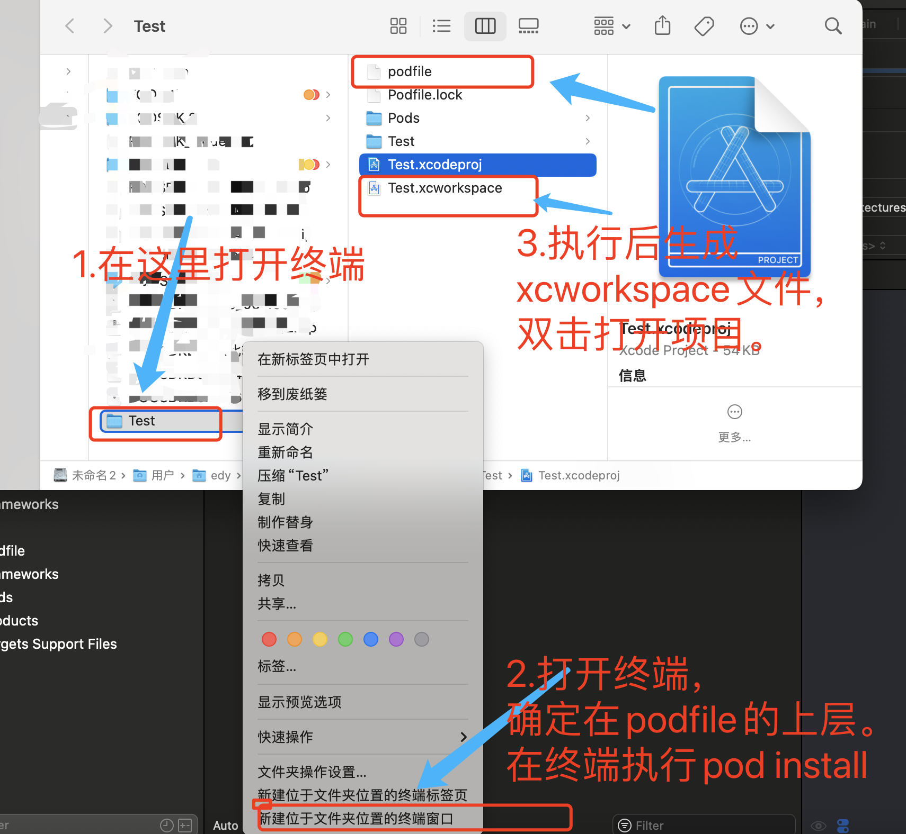

5.添加info.plist参数：添加广告源后需要添加，默认需要添加Applovin的（详情：https://developers.applovin.com/en/max/ios/overview/skadnetwork/）

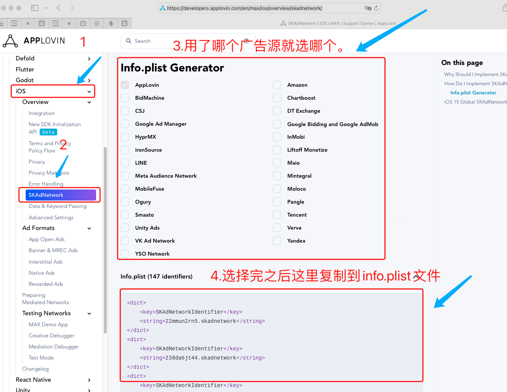

6.关于firebase，需要去firebase后台下载GoogleService-Info.plist文件方法到项目根目录，详情咨询运营。

.关于firebase崩溃监控：需要配置上传崩溃文件：

a.配置dSYM 

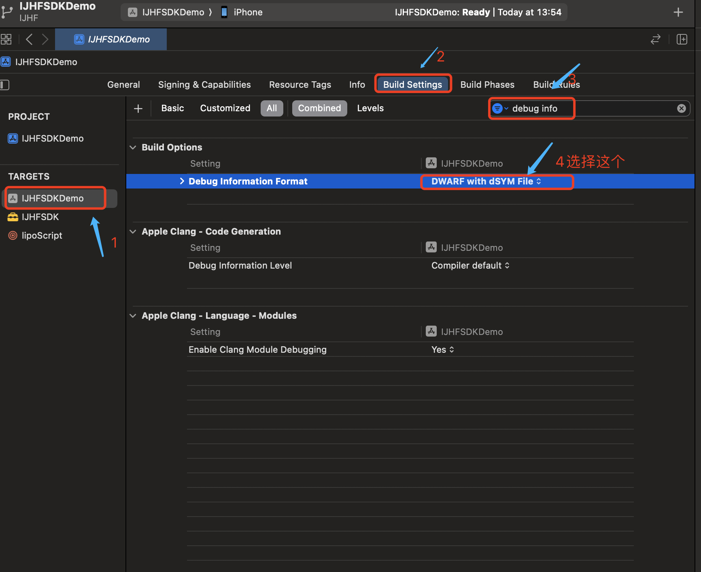

b.配置映射上传脚本：


脚本：

```
chmod u+x "${PROJECT_DIR}/Pods/FirebaseCrashlytics/run"
chmod u+x "${PROJECT_DIR}/Pods/FirebaseCrashlytics/upload-symbols"
"${PROJECT_DIR}/Pods/FirebaseCrashlytics/run" -gsp "${PROJECT_DIR}/GoogleService-Info.plist"
```

input file：（在“Input Files”（输入文件）部分，添加以下文件的位置路径：逐条添加）：

```

${DWARF_DSYM_FOLDER_PATH}/${DWARF_DSYM_FILE_NAME}

${DWARF_DSYM_FOLDER_PATH}/${DWARF_DSYM_FILE_NAME}/Contents/Resources/DWARF/${PRODUCT_NAME}

${DWARF_DSYM_FOLDER_PATH}/${DWARF_DSYM_FILE_NAME}/Contents/Info.plist

$(TARGET_BUILD_DIR)/$(UNLOCALIZED_RESOURCES_FOLDER_PATH)/GoogleService-Info.plist

$(TARGET_BUILD_DIR)/$(EXECUTABLE_PATH)
```

### 广告源配置

#### Applovin Max

##### 增删广告源

1.在podfile文件中新增广告源：（详情：https://developers.applovin.com/en/max/ios/preparing-mediated-networks?networks=707%2C913%2C352%2C969%2C084%2C859%2C938%2C319%2C752）

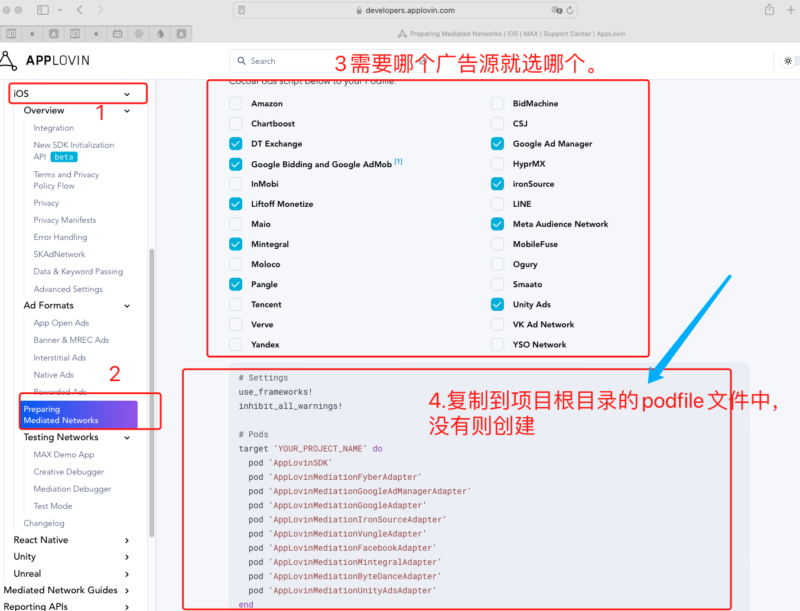


2.将对应广告的配置添加到Info.plist中，注意使用admob时amdob appid必须添加：

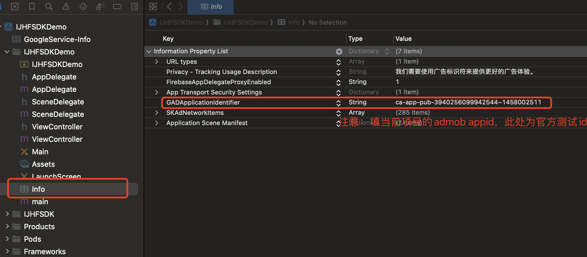

# IOS常见问题

### 1.-mno-thumb 错误


### 2.无权限：


### 3.ios项目在手机上启动后崩溃，看到有文件缺失的log（no such file）


#### 4.卡在Max初始化语句崩溃：+[NSInvocation _invocationWithMethodSignature:frame:]: method signature argument cannot be nil

原因：可能有缓存。

解决方法：打开目录：/Users/edy/Library/Developer/Xcode/DerivedData/，删除项目缓存

#### 5.出现以下报错：


原因：开启了沙盒

解决方法：关闭用户沙盒：User Script Sandboxing 设置为NO

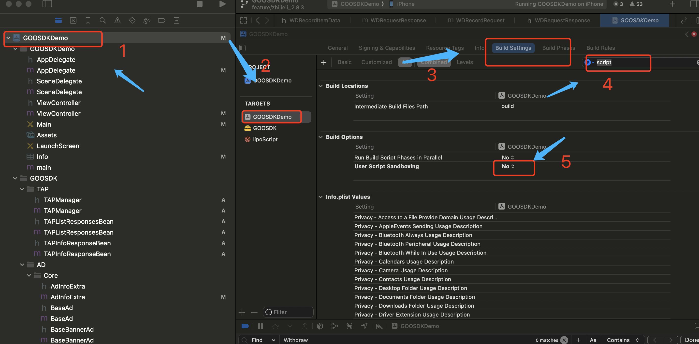

6.报try和catch的问题：

解决办法:

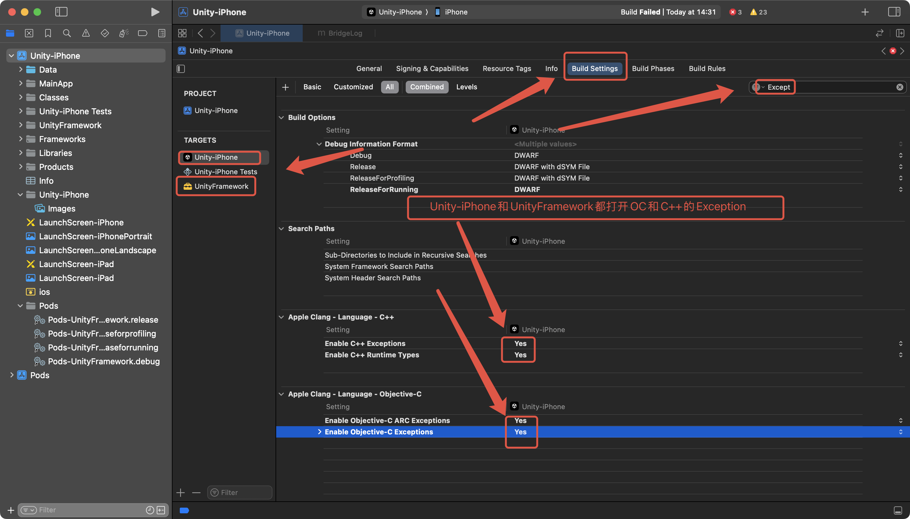

#### 7.Undefined symbols：__swift_FORCE_LOAD$_xxxxx 错误


解决办法：

在项目中创建一个 Swift文件
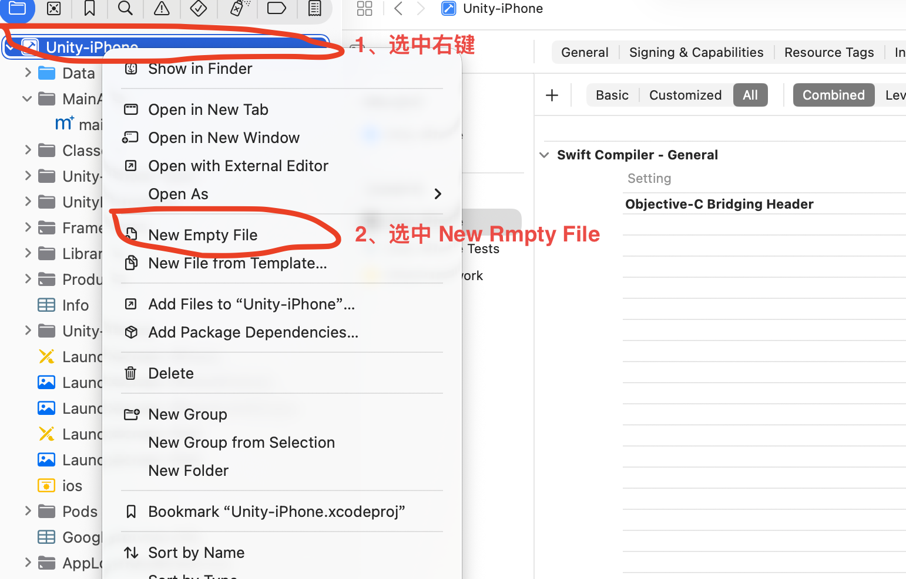
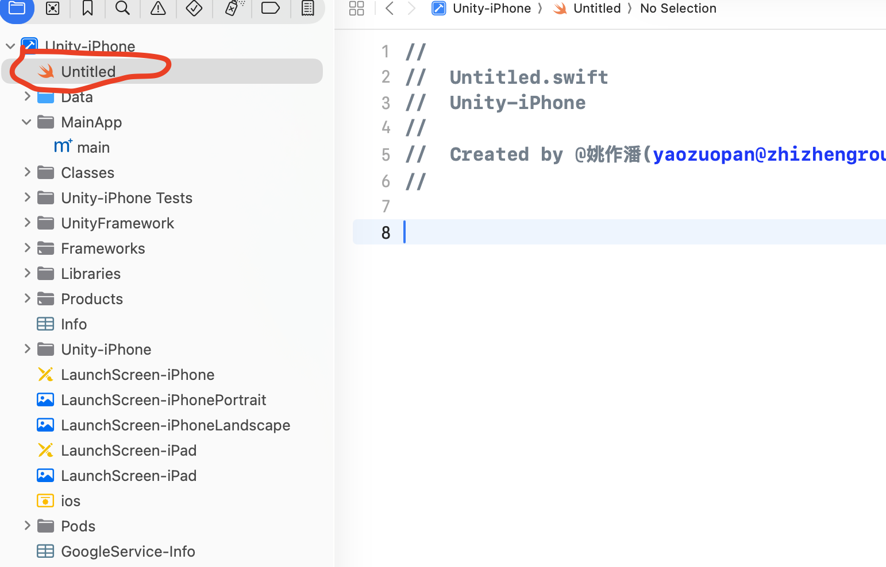

在提示弹窗中选择第一个按钮
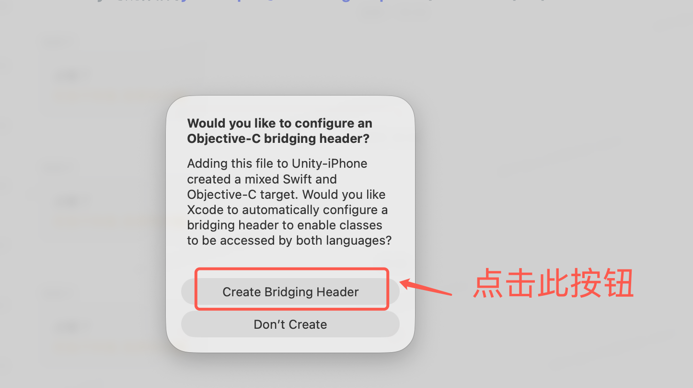
