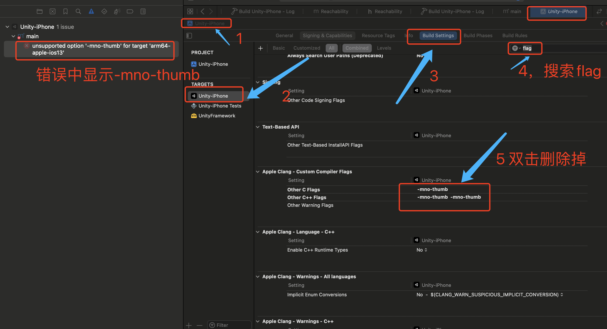
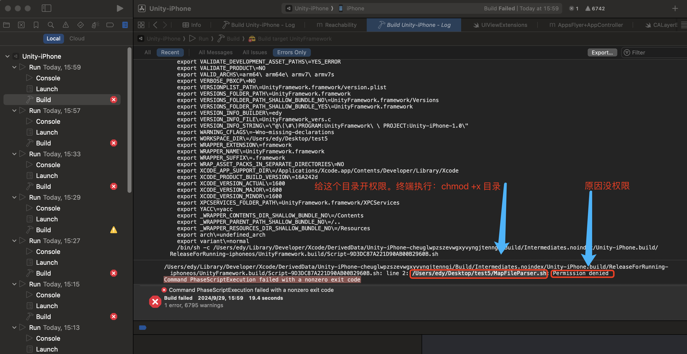
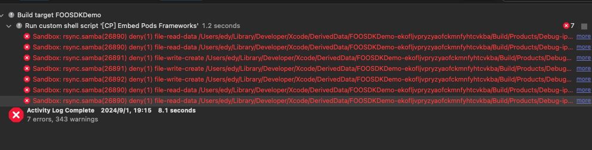
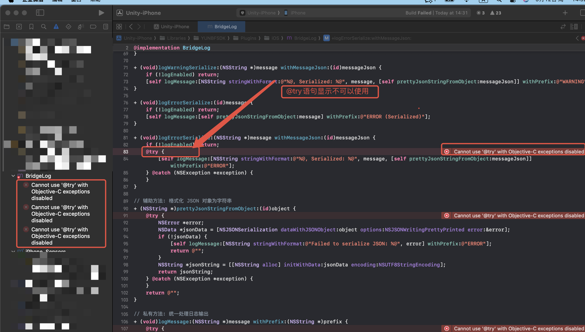

# DDLLSDK

[版本更新记录](./RELEASE.md)

## 集成

### 开发工具与配置

xcode 16 及以后版本

ios 最低支持版本13.0

### CocoaPods集成

配置podfile文件：（这里为必须。另外如需添加其他广告源见[广告源配置]()）：**以下已经固定常见广告源版本，如果不需要的广告源可以去掉对应广告源的可选部分。必须部分不能去掉**。

```
source 'https://github.com/CocoaPods/Specs.git' # 必须
source 'https://github.com/GameGoingGZ/CocoaPodsSpecs.git' # 必须

platform :ios, '13.0'
use_modular_headers!  #必须
target '你的项目Target' do 
	pod 'FirebaseAnalytics', :modular_headers => true      # 必须
 	pod 'FirebaseCrashlytics', :modular_headers => true    # 必须
  pod 'AppsFlyerFramework','6.15.3'                      # 必须
  pod 'DDLLSDK', '6.8.0'														     # 必须
  pod 'AppLovinSDK','13.3.1'                             # 必须
  pod 'AppLovinMediationBidMachineAdapter','3.3.0.0.2'   # 可选，BidMachine广告源
  pod 'AppLovinMediationBigoAdsAdapter','4.8.1.0'        # 可选，Bigo广告源
  pod 'AppLovinMediationByteDanceAdapter','7.4.1.0.0'    # 可选，pangle广告源
  pod 'AppLovinMediationFacebookAdapter','6.20.1.0'      # 可选，Facebook广告源
  pod 'AppLovinMediationFyberAdapter' ,'8.3.8.0'         # 可选，fyber/dt exchange广告源
  pod 'AppLovinMediationGoogleAdapter','12.8.0.0'        # 可选，admob广告源
  pod 'AppLovinMediationGoogleAdManagerAdapter' ,'12.8.0.0' # 可选，google ad manager广告源
  pod 'AppLovinMediationIronSourceAdapter' ,'8.10.0.0.1'    # 可选，ironsource广告源
  pod 'AppLovinMediationMintegralAdapter','7.7.8.0.0'       # 可选，Mintegral广告源
  pod 'AppLovinMediationVungleAdapter','7.5.2.0'            # 可选，vungle广告源
  pod 'AppLovinMediationUnityAdsAdapter','4.16.5.0'         # 可选，unity广告源
  pod 'AppLovinMediationVerveAdapter','3.6.0.0'             # 可选，verve广告源
  pod 'AppLovinMediationYandexAdapter','7.15.1.0'           # 可选，yandex广告源
  pod 'AppLovinMediationMolocoAdapter','4.1.2.0'            # 可选，moloco广告源
  pod 'AppLovinMediationChartboostAdapter','9.9.0.0'        # 可选，chartboost广告源
  pod 'AppLovinMediationInMobiAdapter','10.8.3.1'           # 可选，inmobi广告源
end
```

podfile文件夹目录下执行以下命令：

``` shell
pod install
# 如果使用 pod install 报错，请使用以下命令
# pod install --repo-update
```

### 其他配置

1.xcode 工程根目录位置打开终端 -> 执行 ruby AppLovinQualityServiceSetup-ios.rb

2.使用生成好的文件打开项目：


3.添加info.plist参数：添加广告源后需要添加，默认需要添加Applovin的（详情：https://developers.applovin.com/en/max/ios/overview/skadnetwork/）


4.关于firebase，需要去firebase后台下载GoogleService-Info.plist文件方法到项目根目录，详情咨询运营。

5..关于firebase崩溃监控：需要配置上传崩溃文件：

a.配置dSYM 


b.配置映射上传脚本：


脚本：

```
chmod u+x "${PROJECT_DIR}/Pods/FirebaseCrashlytics/run"
chmod u+x "${PROJECT_DIR}/Pods/FirebaseCrashlytics/upload-symbols"
"${PROJECT_DIR}/Pods/FirebaseCrashlytics/run" -gsp "${PROJECT_DIR}/GoogleService-Info.plist"
```

input file：（在“Input Files”（输入文件）部分，添加以下文件的位置路径：逐条添加）：

```

${DWARF_DSYM_FOLDER_PATH}/${DWARF_DSYM_FILE_NAME}

${DWARF_DSYM_FOLDER_PATH}/${DWARF_DSYM_FILE_NAME}/Contents/Resources/DWARF/${PRODUCT_NAME}

${DWARF_DSYM_FOLDER_PATH}/${DWARF_DSYM_FILE_NAME}/Contents/Info.plist

$(TARGET_BUILD_DIR)/$(UNLOCALIZED_RESOURCES_FOLDER_PATH)/GoogleService-Info.plist

$(TARGET_BUILD_DIR)/$(EXECUTABLE_PATH)
```

### 广告源配置

#### Applovin Max

##### 增删广告源

1.在podfile文件中新增广告源：（详情：https://developers.applovin.com/en/max/ios/preparing-mediated-networks?networks=707%2C913%2C352%2C969%2C084%2C859%2C938%2C319%2C752）


2.将对应广告的配置添加到Info.plist中，注意使用admob时amdob appid必须添加：


### 发布配置

1.关闭Log日志开关(上线必须关闭)

```objective-c
  [ [DDLLConfig getInstance]setPrintLog:NO]];
```

2.关闭debug模式（上线必须关闭）

```objc
  [ [DDLLConfig getInstance]setDebug:NO]];
```

## 接口使用

### 配置

```objective-c
#import <DDLLSDK/DDLLSDK.h>//SDK头文件
#import <DDLLSDK/DDLLSDK-Swift.h>//SDK头文件

DDLLConfig *config = [DDLLConfig getInstance];
[config setAppKey:@""]; // 设置Appkey
[config setAppSecret:@""]; // 设置AppSecret
[config setDebug:YES]; // 是否测试环境，上线时必须设置为NO
[config setPrintLog:YES]; // 是否打印log，上线时必须设置为NO
[config setUmkAppId:@"test"]; // 可选，当用到服务器推送时需要填入，umk app id
[config setAfDevKey:@"test"]; // AppsFlyer Dev Key
[config setIosAppId:@"一串数字"]; // iOS环境下需填入开发者后台的app id
[config setServerUrl:@"https://test"]; // 业务域名,务必以https开头
[config setStatUrl:@"https://test"]; // 打点域名,务必以https开头
[config setAdAppKey:@"test"]; // Max App Key
[config setConfigType:@"mediation"];
[config setVideoID:@"test"]; // 视频广告 ID
[config setInsID:@"test"]; // 插屏广告 ID
[config setOpenID:@"test"]; // 开屏广告 ID
[config setBannerID:@"bac370eebd7370fd"]; // 横幅广告ID
[config setPrivacyPolicyUri:@"https://docs.google.com/d?usp=sharing"]; // 这是一个示例地址，请填写真实地址
[config setTermsOfServiceUri:@"https://docs.google.com/edit?usp=sharing"]; // 这是一个示例地址，请填写真实地址

// 可以通过接口打印查看当前配置
// NSLog(@"当前配置%@",[[DDLLConfig getInstance]toJson]);
```

### 初始化

```c#
// DDLLUserInfo为用户信息
[[DDLLManager getInstance]initWithCompletion:^(BOOL suc,DDLLUserInfo* userInfo)  {
    NSLog(@"初始化%@",suc?@"成功":@"失败");
} uiViewController:self];
    
NSLog(@"当前sdk版本号：%@，版本Name：%@",[[DDLLManager getInstance]getVersionCode],
[[DDLLManager getInstance]getVersionName]);
  
```

其中info是用户信息。

### 广告

#### 激励视频

查看广告是否加载成功

```objective-c
[[DDLLManager getInstance]isRewardAdReady];//激励视频是否加载成功，成功返回1，失败返回0
```

加载并展示

```c#
/// <summary>
/// 加载并展示激励视频广告（激励、插屏、开屏之间比价展示）
/// 没有广告缓存会发起广告请求，5秒内有缓存则展示，无则回调展示失败
/// </summary>
/// <param name="sceneId">广告场景ID，仅用于看数使用，开发者可自定义，但是请保证不同广告场景的命名不同</param>
/// <param name="didReward">激励回调，同时广告也关闭</param>
/// <param name="didFail">展示失败回调</param>
[[DDLLManager getInstance] load2showRewardAdWithSceneID:@"" didReward:^(NSString * _Nullable adUnitId) {
       //激励回调，同时广告也关闭
    } didFail:^(NSString * _Nullable adUnitId) {
        //展示失败回调
    }];

```

#### 插屏

查看广告是否加载成功

```objective-c
[[DDLLManager getInstance]isInterstitialAdReady];//插屏广告是否加载成功，成功返回1，失败返回0
```

展示

```c#
/// <summary>
/// 展示插屏（插屏、开屏之间比价展示）
/// </summary>
/// <param name="sceneId">广告场景ID，仅用于看数使用，开发者可自定义，但是请保证不同广告场景的命名不同</param>
/// <param name="didHide">广告关闭回调</param>
/// <param name="didFail">展示失败回调</param>
[[DDLLManager getInstance]showInterstitialWithSceneID:@"test" didHide:^(NSString * _Nullable adUnitId) {
        //广告展示完成，关闭
    } didFail:^(NSString * _Nullable adUnitId) {
       //展示失败
    }];
```

#### 开屏广告

预加载开屏：

```objective-c
///开屏需要提前预加载才能判断有没有缓存，否则一直都是没缓存
[[DDLLManager getInstance] preLoadOpenAd];
```

查看广告是否加载成功

```objective-c
[[DDLLManager getInstance]isOpenAdReady];//开屏广告是否加载成功，成功返回1，失败返回0
```

展示

```c#
/// <summary>
/// 展示开屏广告，由于广告加载需要时间，建议开发者在应用启动时多等待几秒再调用开屏广告
/// </summary>
/// <param name="sceneId">广告场景ID，仅用于看数使用，开发者可自定义，但是请保证不同广告场景的命名不同</param>
/// <param name="didHide">广告关闭回调</param>
/// <param name="didFail">展示失败回调</param>
[[DDLLManager getInstance]showOpenAdWithSceneId:@"" didHide:^(NSString * _Nullable adUnitId) {
      //广告关闭回调
    } didFail:^(NSString * _Nullable adUnitId) {
      // 展示失败回调
    }];
```

### 统计

#### 打点到BI

附带拓展参数

```c#
//第一种map做参数
NSMutableDictionary *map = [NSMutableDictionary dictionary];
map[@"key"] = @"value";
[[DDLLManager getInstance]trackWithEventName:@"eventName" dictMap:map];
  
//第二种json字符串做参数
[[DDLLManager getInstance]trackWithEventName:@"eventName" eventJson:@"{\"key\":\"value\"}"];
```


#### 打点到AppsFlyer

如果有特殊需要，可使用下列方法打点到AppsFlyer

```c#
NSMutableDictionary *map = [NSMutableDictionary dictionary];
map[@"key"] = @"value";
   
[[DDLLManager getInstance]afTrackWithEventName:@"eventName" eventMap:map];
//其中key 也可以使用 AFInAppEvents.XXXX 内置的key
```


### 网络接口

⚠️ ***注意：所有接口请在初始化完成后调用。***

#### 获取配置

获取普通游戏配置

```c#
/// <summary>
/// 请求游戏配置
/// </summary>
/// <param name="bizCodes">请求的业务编码，多个之间使用半角逗号分隔</param>
/// <param name="completeAction"></param>
[[DDLLManager getInstance]feachDDLLGameConfigWithBizCodes:@"test" andCallback:^(BOOL
success, NSArray<DDLLGameConfig *> * _Nullable response) {
if (success) {
   for (DDLLGameConfig * f in response) {
      NSLog(@"当前游戏配置：%@",f.configContent);
    }
  }
}];
```


#### 获取Ark配置

```c#
/// <summary>
/// 请求方舟策略
/// </summary>
/// <param name="bizCodes">请求的业务编码，多个之间使用半角逗号分隔</param>
/// <param name="completeAction"></param>
[[DDLLManager getInstance]feachArkConfigWithBizCodes:@"test" andCallback:^(BOOL success, NSArray<DDLLArkData *> * _Nullable response) {
        NSLog(@"当前方舟配置LocalValueConfig：");
        if (success) {
            NSLog(@"当前方舟配置LocalValueConfig：success");
          //  for (ArkData * f in response) {
               
          //  }
        }
        
    }];
```

#### 获取提现接口

```c#
/// <summary>
/// 申请提现
/// </summary>
/// <param name="assetsType">资产类型</param>
/// <param name="paymentType">支付方式Paypal,giftcard-amazon,payerMax-PagBank,payerMax-PIX,payerMax-DANA中任一种</param>
/// <param name="account">提现账户：即用户邮箱或电话号码</param>
/// <param name="name">PIX类型必填 提现用户昵称</param>
/// <param name="amount">提现数额</param>
/// <param name="act"></param>
/// <param name="disanfangzhanghuleixing">PIX类型必填 ，传值 E、P、C、B E:邮箱 P:手机号 C:(个人税号(CPF)/企业税号(CNPJ) B:(虚拟支付地址(EVP))</param>
/// <param name="gerenshibiehao">PIX类型必填 gerenshibiehao 收款方个人识别号码，在不同国家下可选类型不同 格式： 999.999.999-99 或 99999999999</param>
[[DDLLManager getInstance] requestMicroWDWithAssetsType:0 paymentType:@"" account:@"" name:@"" amount:0.0 disanfangzhanghuleixing:@"" gerenshibiehao:@"" completion:^(BOOL success, DDLLWDRequestResponse * _Nonnull response) {
        // NSLog(@"请求提现记录接口:%@",response?[response toDictionary]:@"");
}];

```

#### 获取提现记录接口

```c#
     /// <summary>
     /// 获取提现记录
     /// </summary>
     /// <param name="assetsType">货币类型,0:金币提现,8:现金提现</param>
     /// <param name="withdrawType">0:普通提现，2: 固定小额提款, 3: 邀请好友提现</param>
     /// <param name="act"></param>

[[DDLLManager getInstance] getWDRecordWithCompletion:^(BOOL success, DDLLWDRecordData * _Nonnull data) {
    // NSLog(@"请求提现记录接口:%@",data?[data toDictionary]:@"");
}];

```

#### **激励用户判断**

```objective-c
BOOL isRewarded = [[DDLLManager getInstance]home];//返回YES（1）激励用户，NO（0）非激励用户
```

#### 服务器时间：

```objective-c
        NSLog(@"服务器时间戳：%ld",[[DDLLManager getInstance]getServerRealTimeStamp]);
         NSLog(@"服务器时间日期%@",[[DDLLManager getInstance]getServerRealTimeData]);

```

## 数据结构

### UserInfo

```c#
@interface DDLLUserInfo : NSObject <NSCoding>

@property (nonatomic, strong) NSString *uk; // 用户ID
@property (nonatomic, assign) int activeDays; // 活跃天数
@property (nonatomic, assign) int registerDays; // 注册天数
@property (nonatomic, assign) double serverTimeStamp; // 服务器时间戳
@property (nonatomic, strong) NSString *now; // 服务器时间
@property (nonatomic, strong) NSString *country; // 国家
@property (nonatomic, assign) double createTimeStamp; // 注册时间
@property (nonatomic, strong) NSString *inviteCode; // 邀邀请码
@property (nonatomic, strong) NSString *channel; // 渠道信息
@end
```

提现记录：

```objective-c
@interface DDLLWDRecordItemData : NSObject

/// 记录ID
@property (nonatomic, strong) NSString *identifier;

/// 提现类型, (默认)0:金币提现 , 8: 现金提现
@property (nonatomic, assign) int zichanleixing; 

/// 提现方式, Paypal, Zhifubao, ovo, paytm, phonebill-Telkomsel, phonebill-Tairtel, giftcard-amazon中任一种
@property (nonatomic, strong) NSString *zhifufangshi; 

/// 提现金额
@property (nonatomic, assign) float total; 

/// 0:用户提交申请 , 1:已审核通过, 2: 驳回, 3: 已打款
@property (nonatomic, assign) int status;

/// 提现时间
@property (nonatomic, strong) NSString *tixianshijian;

@end

```


## 常见问题

### 1.-mno-thumb 错误



### 2.无权限：



### 3.ios项目在手机上启动后崩溃，看到有文件缺失的log（no such file）


#### 4.卡在Max初始化语句崩溃：+[NSInvocation _invocationWithMethodSignature:frame:]: method signature argument cannot be nil

(null)

原因：可能有缓存。

解决方法：打开目录：/Users/edy/Library/Developer/Xcode/DerivedData/，删除项目缓存

#### 5.出现以下报错：



原因：开启了沙盒

解决方法：关闭用户沙盒：User Script Sandboxing 设置为NO


#### 6.报try和catch的问题：


解决办法:


#### 7.Undefined symbols：__swift_FORCE_LOAD$_xxxxx 错误


解决办法：

在项目中创建一个 Swift文件


在提示弹窗中选择第一个按钮
